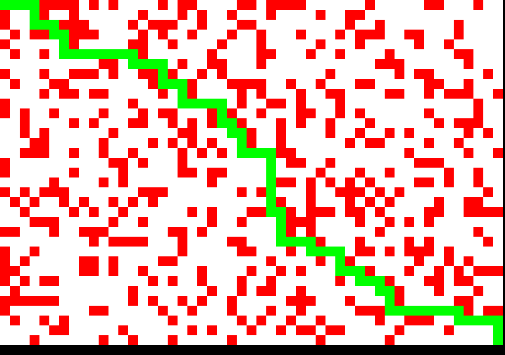

# Maze Generator
## Instructions
* Specify amount of rows and columns
* Run `maze_creator.py`
## Example

# Maze Solver
## Instructions
* Create a maze using `maze_creator.py`
* Run `maze_shower.py`
* Create new mazes using RETURN
## Example

# A* Visualiser
## Instructions
* Run `a_star_visualise.py`
* Press RETURN to solve
* Press R to reset
## Example

